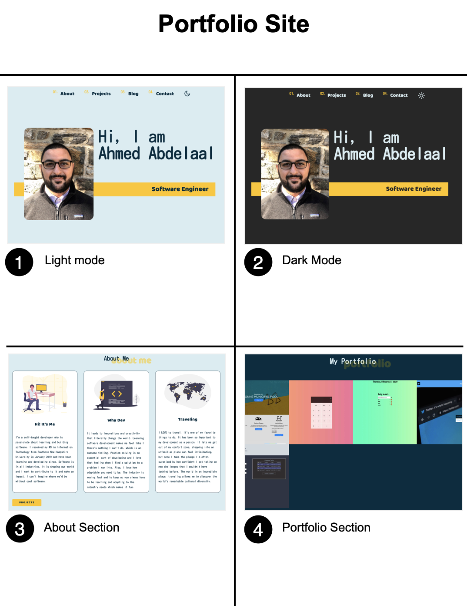

# 💻 Peronal Website

[](https://app.netlify.com/sites/boring-benz-607be6/deploys)

<p align="center">
  The second iteration of <a href="https://aa-dev.io/" target="_blank">https://aa-dev.io/</a> built with <a href="https://www.gatsbyjs.org/" target="_blank">Gatsby</a> and hosted with <a href="https://www.netlify.com/" target="_blank">Netlify</a>
</p>

<p align="center">
  Checkout the project <a href="https://aa-dev.io/" target="_blank">Here</a>
  Checkout the previous iteration (v1) <a href="https://shrki416.github.io/Portfolio-Site/" target="_blank">Here</a>
</p>



## 🛠 Installation & Set Up

1. Install the Gatsby CLI

   ```sh
   npm install -g gatsby-cli
   ```

2. Install and use the correct version of Node using [NVM](https://github.com/nvm-sh/nvm)

   ```sh
   nvm install
   ```

3. Install dependencies

   ```sh
   npm install
   ```

4. Start the development server

   ```sh
   gatsby develop
   ```

## 🧐 What's inside?

A quick look at the top-level files and directories you'll see in a Gatsby project.

    .
    ├── node_modules
    ├── src
    ├── .gitignore
    ├── .prettierrc
    ├── gatsby-browser.js
    ├── gatsby-config.js
    ├── gatsby-node.js
    ├── gatsby-ssr.js
    ├── LICENSE
    ├── package-lock.json
    ├── package.json
    └── README.md

1.  **`/node_modules`**: This directory contains all of the modules of code that your project depends on (npm packages) are automatically installed.

2.  **`/src`**: This directory will contain all of the code related to what you will see on the front-end of your site (what you see in the browser) such as your site header or a page template. `src` is a convention for “source code”.

3.  **`.gitignore`**: This file tells git which files it should not track / not maintain a version history for.

4.  **`.prettierrc`**: This is a configuration file for [Prettier](https://prettier.io/). Prettier is a tool to help keep the formatting of your code consistent.

5.  **`gatsby-browser.js`**: This file is where Gatsby expects to find any usage of the [Gatsby browser APIs](https://www.gatsbyjs.org/docs/browser-apis/) (if any). These allow customization/extension of default Gatsby settings affecting the browser.

6.  **`gatsby-config.js`**: This is the main configuration file for a Gatsby site. This is where you can specify information about your site (metadata) like the site title and description, which Gatsby plugins you’d like to include, etc. (Check out the [config docs](https://www.gatsbyjs.org/docs/gatsby-config/) for more detail).

7.  **`gatsby-node.js`**: This file is where Gatsby expects to find any usage of the [Gatsby Node APIs](https://www.gatsbyjs.org/docs/node-apis/) (if any). These allow customization/extension of default Gatsby settings affecting pieces of the site build process.

8.  **`gatsby-ssr.js`**: This file is where Gatsby expects to find any usage of the [Gatsby server-side rendering APIs](https://www.gatsbyjs.org/docs/ssr-apis/) (if any). These allow customization of default Gatsby settings affecting server-side rendering.

9.  **`LICENSE`**: Gatsby is licensed under the MIT license.

10. **`package-lock.json`** (See `package.json` below, first). This is an automatically generated file based on the exact versions of your npm dependencies that were installed for your project. **(You won’t change this file directly).**

11. **`package.json`**: A manifest file for Node.js projects, which includes things like metadata (the project’s name, author, etc). This manifest is how npm knows which packages to install for your project.

12. **`README.md`**: A text file containing useful reference information about your project.

## Summary

This website is made with Gatsby and hosted on Netlify. It is the second iteration of my personal website. I wanted to make my personal site with React, and I ended up picking up Gatsby in the process. It wasn't easy, but it was a lot of fun to make.

### Author

- Ahmed Abdelaal - [Website](https://aa-dev.io/) | [LinkedIn](https://www.linkedin.com/feed/)
